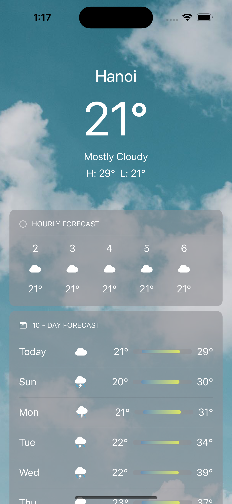
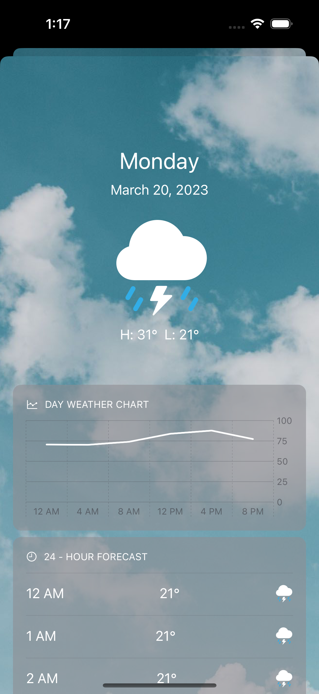

# Weather App

Home screen                |  Day screen
:-------------------------:|:-------------------------:
  |  

iOS Weather application using SwiftUI and WeatherKit to display weather forecast based on user's' location. 

## Functions
* Home screen displays weather information similar to the weather app on iPhone previous.
* Tapping on the day row will show the sheet coming from the bottom to show the weather forecast from the day selected.
* Day screen shows brief weather infomation of day selected, chart and hourly forecast.

## Projects structure, technologies and methodologies
* MVVM as base structure, discerning file using the feature-first appoach.
* SwiftUI for UI building.
* WeatherKit as weather source.
* Reactive programing with Combine framework.

## Future Improvements:
* Adding Units Test ViewModels and Utilities classes
* Adding appropriate comments/descriptions to classes and methods
* Improve Day screen (Chart + Hourly item UI)
